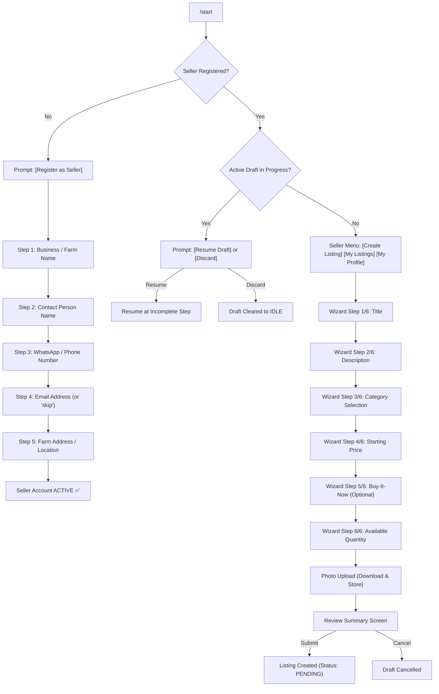
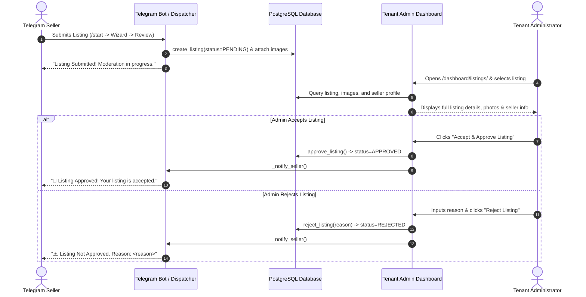

# Phase 07.7 — Seller Telegram Registration & Listing Workflow Audit

**Date**: 2026-09-28  
**Scope**: Seller Telegram registration, profile management, listing wizard, photo upload and tenant storage, review screen, submission to moderation, dashboard review/approve/reject, and seller notifications.

---

## 1. Discovery (What Existed Before)

- **Listing Domain**: Minimal `Listing` model with `seller_id` stored only as a raw string. No `Seller` profile model existed. No `ListingImage` model existed to store and associate media assets with listings.
- **Telegram Engine**: Webhook dispatcher handled secret token authentication and command routing (`/start`, `/help`), but lacked persistent multi-step conversation state management. Process restarts or multi-step questionnaires would lose state.
- **Legacy System (`CYG_Aquatics_Malaysia` — Read-Only Reference)**:
  - 4,000+ line monolithic script (`fish_registration.py`) using in-memory conversation handlers.
  - Used single `Fish` table for both listings, auctions, and seller telegram IDs. No formal seller profile entity existed.
  - Flat, non-tenant-isolated file storage in `photos/` and `videos/`.

---

## 2. Implementation

### A. Data Models Added
1. **`Seller` (`apps/listings/models.py`)**:
   - `TenantOwnedModel` scoped strictly to a single tenant.
   - Foreign key to `TelegramUser` (`related_name='seller_profiles'`).
   - Fields: `seller_id`, `business_name`, `contact_name`, `phone`, `email`, `address`, `status` (`ACTIVE`, `PENDING`, `SUSPENDED`, `REJECTED`).
   - Unique constraints: `["tenant", "telegram_user"]` and `["tenant", "seller_id"]`.
2. **`ListingImage` (`apps/listings/models.py`)**:
   - `TenantOwnedModel` attached to `Listing` (`related_name='images'`).
   - Fields: `image` (ImageField), `file_url`, `telegram_file_id`, `caption`, `order`.
   - Preserves photo ordering and gallery sequence.
3. **`TelegramConversationState` (`apps/telegram_engine/models.py`)**:
   - `TenantOwnedModel` tracking conversational state machine per user and bot type.
   - States: `IDLE`, `REGISTERING`, `CREATING_LISTING`, `REVIEWING_LISTING`.
   - Sub-step string (`step`) and JSON payload (`context_data`) for robust draft persistence across webhook requests and process restarts.

### B. Application Services & State Machine
1. **`SellerWorkflow` (`apps/telegram_engine/seller_workflow.py`)**:
   - Explicit state machine decoupling conversation logic from webhook transport.
   - Handles seller registration questionnaire, listing creation wizard, draft recovery, review screens, and profile views.
2. **Listing Services (`services/listings.py`)**:
   - Enhanced `approve_listing()` and `reject_listing()` to automatically trigger branded Telegram notification messages to the seller.
   - Added `attach_listing_image()`.
3. **Telegram Service (`services/telegram.py`)**:
   - Added `get_file()` and `download_file()` for secure file fetching from Telegram Bot API into tenant-isolated directories (`media/tenants/<tenant_slug>/listings/`).

### C. Dashboard Review & Moderation Integration (`apps/dashboard`)
- **`listing_detail_view`**: Prefetches attached listing images and seller contact information.
- **`detail.html`**: Renders photo showcase, thumbnails, seller details (business name, contact person, phone, location), and rejection reason input.
- **`sellers_list_view`**: Uses `Seller` model counts for Total Sellers, Active Sellers, Pending Approval, and Blocked Sellers.

---

## 3. Telegram Seller Flow

---

## 4. Dashboard Moderation Flow

---

## 5. Security & Isolation Verification

1. **Tenant Isolation**:
   - `Seller` and `ListingImage` models strictly inherit `TenantOwnedModel`.
   - All state transitions and database queries are parameterized by `self.tenant`.
   - Verified that a seller registered in Tenant A (e.g. CYG Malaysia) cannot create listings, drafts, or access resources in Tenant B (e.g. AquaBid Australia).
2. **Seller Isolation**:
   - Each seller profile is unique to `(tenant, telegram_user)`.
   - Only the authenticated Telegram user owning the active draft can input fields, upload images, or trigger `submit_listing`.
3. **Callback Tampering**:
   - Callbacks (`cat_select:*`, `create_listing`, `submit_listing`, `cancel_listing`, `resume_listing`) are strictly scoped to the authenticated Telegram user and active conversation state. Tampered callback payloads are rejected safely.
4. **Idempotency & Duplicate Update Handling**:
   - Every Telegram update passes through `TelegramUpdateLog` deduplication. Duplicate webhooks are acknowledged with HTTP 200 without creating duplicate sellers, duplicate listings, or re-sending notifications.
5. **Media Security**:
   - Uploaded files are downloaded via Telegram Bot API over HTTPS and stored under tenant-isolated paths (`media/tenants/<tenant_slug>/listings/<uuid>.<ext>`). Directory traversal and client-supplied filenames are prevented.

---

## 6. Automated Test Results

| Test Module | Test Focus | Tests Run | Result |
| :--- | :--- | :--- | :--- |
| `apps.telegram_engine.tests` | Webhook security, dispatcher, idempotency, seller registration flow, listing wizard, photo upload, draft recovery, seller notification | 26 | **26/26 PASSED** |
| `apps.listings.tests` | Listing domain, quantity validation, state transitions, Seller model uniqueness, ListingImage ordering & attachment | 7 | **7/7 PASSED** |
| `apps.dashboard.tests` | Dashboard KPIs, cross-tenant isolation, IDOR, staff roles, permissions | 35 | **35/35 PASSED** |
| `apps.tenants.tests` | Tenant models, membership security, super admin reset, zero plaintext passwords | 14 | **14/14 PASSED** |
| **Total Automated Suite** | **Domain, Telegram Engine, Dashboard, Security** | **82** | **82/82 PASSED** |

---

## 7. Live Production Smoke Test

- **Target Webhook**: `POST https://auctionbot.shop/telegram/webhook/cyg-malaysia/SELLER/`
- **Test 1: Live Command Dispatch (`/start`)**:
  - Request: Synthetic update `update_id=999001` with `/start` command.
  - Response: `HTTP 200 {"status": "ok", "update_id": 999001, "result": {"handled": true, "type": "command", "command": "start", "user_id": 12345678, "chat_id": 12345678}}`
- **Test 2: Live Idempotency & Deduplication**:
  - Request: Duplicate update `update_id=999001` sent to webhook.
  - Response: `HTTP 200 {"status": "duplicate", "update_id": 999001}` (Safely ignored without duplicate processing).

---

## 8. Remaining Issues

- None blocking Phase 07.7.
- In accordance with Phase 07.7 scope boundaries:
  - Buyer auction browsing, live bidding buttons, wallet top-up/withdrawal, and outbid notifications are reserved for future phases.
  - Legacy project `E:\auctionbots\CYG_Aquatics_Malaysia` was kept strictly read-only; no data migration was performed.
