# Phase 07.8 — Legacy Telegram UX Specification (Immutable Reference)

**Status**: Authoritative Behavioral & UX Specification  
**Source Code Analyzed**:
1. `E:\auctionbots\CYG_Aquatics_Malaysia\show_bidding_list.py` (Buyer / Bidding Bot — Bot 1)
2. `E:\auctionbots\CYG_Aquatics_Malaysia\fish_registration.py` (Seller / Listing Bot — Bot 2)
3. `E:\auctionbots\CYG_Aquatics_Malaysia\home\models.py` (Legacy Data Models)

---

## 1. System Architecture Overview & Bot Types

In the legacy implementation, there are **two distinct Telegram bots** (or bot personas):
1. **Buyer / Bidding Bot (`show_bidding_list.py`)**: Used by buyers/bidders to browse auctions, place bids, manage wishlist/favorites, check out won lots, view bids, track auctions ending soon, and manage delivery address.
2. **Seller / Listing Bot (`fish_registration.py`)**: Used by sellers to create listings (Auction or Buy It Now), upload media (up to 4 images and video), view active/closed/sold listings, manage seller wallet balance, access helpdesk, and view group/about info.

Both bots use persistent custom keyboards (`ReplyKeyboardMarkup`) for their top-level menu, accompanied by contextual `InlineKeyboardMarkup` keyboards for workflows, selections, and actions.

---

## 2. Buyer Bot UX Specification (`show_bidding_list.py`)

### 2.1 Trigger: `/start`

#### A. Trigger
Telegram command `/start` sent to Buyer Bot.

#### B. Execution Flow & Logic
1. Sends initial greeting:
   ```text
   Welcome!
   ```
   *Keyboard*: `ReplyKeyboardRemove()` (clears any active keyboard during check).
2. Checks if user is blocked in `PaymentWallet.blocked_users`:
   - If blocked, sends:
     ```text
     ⚠️ You cannot access this bot as you are blocked.
     ```
     *(Stops flow)*
3. Checks if `require_buyer_contact_details` is enabled and if `buyer.details` is empty:
   - If contact details missing:
     ```text
     ⚠️ You need to provide your contact details first.
     ```
     *Keyboard Type*: `InlineKeyboardMarkup`
     *Row 1*: `[Update Details]` (callback: `update_buyer_contact_details_`)
     *(Stops flow until details provided)*
4. Checks if password protection is enabled (`require_password`):
   - If password required and not authenticated:
     ```text
     🔒 Please enter the password to access this bot.
     ```
     *(Registers next step to verify password)*
     - If password matches:
       ```text
       You have been authorized! 
       Welcome! Please choose an option:
       ```
       *Keyboard Type*: `ReplyKeyboardMarkup` (Buyer Main Menu)
     - If password incorrect:
       ```text
       ❌ Incorrect password. Please try again.
       ```
   - If password NOT required (or user already authorized):
     ```text
     Please choose an option:
     ```
     *Keyboard Type*: `ReplyKeyboardMarkup` (Buyer Main Menu)

---

### 2.2 Buyer Main Menu Keyboard

*Keyboard Type*: `ReplyKeyboardMarkup(row_width=2, resize_keyboard=True)`

```text
Row 1: [Start]               [Helpdesk]
Row 2: [❤️ My Favourites]    [Check Out]
Row 3: [My Bids]             [Auction Ending Soon]
Row 4: [Join Group]          [About]
Row 5: [My Delivery Address]
```

---

### 2.3 Buyer Menu Actions & Handlers

#### Action: `Start`
- **Trigger**: User sends text `"Start"`
- **Message**:
  ```text
  Click the button below to see all the fishes listings:
  ```
- **Keyboard Type**: `InlineKeyboardMarkup`
  - **Row 1**:
    - `[Show All Auctions]` (callback: `show_listings`)
    - `[Show All Buy It Now]` (callback: `buy_now_listings`)

---

#### Action: `Show All Auctions` (Callback `show_listings`)
- **Trigger**: Inline button clicked with `callback_data="show_listings"`
- **Empty State** (if no open listings):
  ```text
  No listings at the moment.
  ```
- **Listings State**:
  For each open listing (`status='Open'`, `category='Auction'`):
  1. **Primary Caption / Text**:
     ```text
     Listing ID: [#{listing.id}]
     Title: {listing.title}
     Quantity: {listing.quantity}
     Contact Details: {listing.contact}
     --------------------
     Auction Price: ${current_bid_price}
     Auction End Time: {end_time}
     --------------------
     Current Bidder: {last_bidder}
     ```
     *(Note: If no previous bids, `Current Bidder: None`)*
     *(Format of `end_time`: `%d-%m-%Y %I:%M %p`)*
  2. **Image Media Group**:
     - Up to 4 images sent as `send_media_group` with caption above.
     - If no images, sent as standard text message.
  3. **Description Message**:
     ```text
     Description: {listing.description}
     ```
  4. **Video Message / Action Buttons**:
     - If video exists: sends video with caption `Item Video:`.
     - If no video: sends text:
       ```text
       No video available.
       ```
     - **Attached Inline Keyboard** (`create_bid_button`):
       - If bids already exist:
         - **Row 1**: `[Start Bid]` (callback: `start_bid_{listing_id}`) | `[❤️]` (callback: `wishlist_{listing_id}`)
       - If no bids exist:
         - **Row 1**: `[Start Bid]` (callback: `start_bid_{listing_id}`) | `[Make Offer ]` (callback: `make_auction_offer_{listing_id}`) | `[❤️]` (callback: `wishlist_{listing_id}`)
  5. **Divider**:
     ```text
     ____________________________________________________________
     ```

---

#### Action: `Start Bid` (Callback `start_bid_{listing_id}`)
- **Trigger**: Inline button clicked with `callback_data="start_bid_{listing_id}"`
- **Messages**:
  1. Acknowledges process:
     ```text
     Starting the bidding process for Listing ID #{listing.id}.
     ```
  2. Prompts bid amount with dynamic buttons:
     - If existing highest bidder:
       ```text
       Please choose your bid amount. Current bidding price: ${current_bid_price} by {current_bidder}
       ```
     - If no bids yet:
       ```text
       Please choose your bid amount. Current bidding price: ${current_bid_price}
       ```
- **Keyboard Type**: `InlineKeyboardMarkup` (`create_bid_amount_buttons`)
  - Generates 6 increment steps based on `min_bid`:
    - Row 1: `[${min_bid * 1}]` (callback: `bid_amount_{listing_id}_{min_bid*1}`)
    - Row 2: `[${min_bid * 2}]` (callback: `bid_amount_{listing_id}_{min_bid*2}`)
    - Row 3: `[${min_bid * 3}]` (callback: `bid_amount_{listing_id}_{min_bid*3}`)
    - Row 4: `[${min_bid * 4}]` (callback: `bid_amount_{listing_id}_{min_bid*4}`)
    - Row 5: `[${min_bid * 5}]` (callback: `bid_amount_{listing_id}_{min_bid*5}`)
    - Row 6: `[${min_bid * 6}]` (callback: `bid_amount_{listing_id}_{min_bid*6}`)
    - Row 7: `[Cancel]` (callback: `cancel_process`)

---

#### Action: `Place Bid Amount` (Callback `bid_amount_{listing_id}_{amount}`)
- **Trigger**: Inline button clicked with `callback_data="bid_amount_{listing_id}_{amount}"`
- **Execution**:
  - Increments current price: `new_amount = current_amount + amount`
  - Atomic persistence in database.
- **Message**:
  ```text
  You have placed a bid of ${amount} on Listing ID {listing.id}. The current amount is now ${new_amount}.
  ```
- **Keyboard Type**: `InlineKeyboardMarkup`
  - **Row 1**:
    - `[Refresh]` (callback: `refresh_auction_listing_{listing_id}`)
    - `[Add Bid]` (callback: `start_bid_{listing_id}`)

---

#### Action: `Refresh Listing` (Callback `refresh_auction_listing_{listing_id}`)
- **Trigger**: Inline button clicked with `callback_data="refresh_auction_listing_{listing_id}"`
- **Behavior**:
  - Re-fetches listing details and most recent bid.
  - If listing is closed:
    ```text
    Listing closed.
    ```
  - If open: re-renders the listing caption, images, description, video/buttons exactly like `show_listings`.

---

#### Action: `Cancel Process` (Callback `cancel_process`)
- **Trigger**: Inline button clicked with `callback_data="cancel_process"`
- **Message**:
  ```text
  Process has been cancelled.
  /start
  ```

---

#### Action: `❤️ Add to Wishlist / Favourites` (Callback `wishlist_{listing_id}`)
- **Trigger**: Inline button clicked with `callback_data="wishlist_{listing_id}"`
- **Callback Answer** (Notification popup):
  - On first add:
    ```text
    Listing #{listing.id} added to My ❤️.
    ```
  - If already added:
    ```text
    Listing is already in My ❤️.
    ```

---

#### Action: `Remove from Wishlist` (Callback `remove_from_wishlist_{wishlist_id}`)
- **Trigger**: Inline button clicked with `callback_data="remove_from_wishlist_{wishlist_id}"`
- **Callback Answer**:
  ```text
  Listing removed from My ❤️.
  ```

---

#### Action: `❤️ My Favourites` (Menu Button)
- **Trigger**: User sends text `"❤️ My Favourites"`
- **Empty State**:
  ```text
  You have no items in My ❤️.
  ```
  *Keyboard*: `create_custom_keyboard()`
- **Populated State**:
  For each wishlisted listing: renders listing caption, images, description, and action buttons:
  - `[Start Bid]` (callback: `start_bid_{listing_id}`)
  - `[Remove ❤️]` (callback: `remove_from_wishlist_{wishlist_id}`)

---

#### Action: `Check Out` (Menu Button)
- **Trigger**: User sends text `"Check Out"`
- **Empty State**:
  ```text
  No listings found.
  ```
- **Populated State**:
  ```text
  Here are the won listings and accepted offers:
  ```
  For each won auction / accepted offer:
  ```text
  Listing ID: [#{listing.id}]
  Title: {listing.title}
  Contact Details: {listing.contact}
  --------------------
  Price: ${price}
  Quantity: {quantity}
  Start Time: {start_at}
  End Time: {end_time}
  Purchase Date: {purchased_at}
  ```

---

#### Action: `My Bids` (Menu Button)
- **Trigger**: User sends text `"My Bids"`
- **Empty State**:
  ```text
  No listings found.
  ```
- **Populated State**:
  ```text
  Here are your active bids :
  ```
  Followed by active listings with `[Start Bid]` button.

---

#### Action: `Auction Ending Soon` (Menu Button)
- **Trigger**: User sends text `"Auction Ending Soon"`
- **Empty State**:
  ```text
  No listings found.
  ```
- **Populated State**:
  Renders all listings ending within 24 hours that user placed bids on.

---

#### Action: `Join Group` (Menu Button)
- **Trigger**: User sends text `"Join Group"`
- **Message**:
  ```text
  {settings.group_details}
  ```

---

#### Action: `About` (Menu Button)
- **Trigger**: User sends text `"About"`
- **Message**:
  ```text
  {settings.about_us}
  ```

---

#### Action: `Helpdesk` (Menu Button)
- **Trigger**: User sends text `"Helpdesk"`
- **Message**:
  ```text
  {settings.helpdesk_details}
  ```

---

#### Action: `My Delivery Address` (Menu Button)
- **Trigger**: User sends text `"My Delivery Address"`
- **Message**:
  ```text
  Your contact details are: 
  {buyer.details}
  ```
- **Keyboard Type**: `InlineKeyboardMarkup`
  - **Row 1**: `[Update Details]` (callback: `update_buyer_contact_details_`)
- **When `[Update Details]` Clicked**:
  ```text
  Enter the following details:
  Name:
  Email:
  Contact No:
  Address:
  ```
- **When User Sends Details**:
  ```text
  Your details have been updated successfully.
  ```
  *Keyboard*: `create_custom_keyboard()` (Buyer Main Menu)

---

#### Action: `/cancel` (Command)
- **Trigger**: User sends `/cancel`
- **Message**:
  ```text
  Process Cancelled. 
  You can start again by using /start.
  Or use /cancel to cancel any process.
  ```

---

## 3. Seller Bot UX Specification (`fish_registration.py`)

### 3.1 Trigger: `/start`

#### A. Trigger
Telegram command `/start` sent to Seller Bot.

#### B. Execution Flow & Logic
1. Checks if seller is blocked in `PaymentWallet.blocked_users`:
   - If blocked:
     ```text
     ⚠️ You cannot access this bot as you are blocked.
     ```
2. Checks password requirement (`SellerBotPasswordSettings`):
   - If password required and unauthenticated:
     ```text
     🔒 Please enter the password to access this bot.
     ```
   - On correct password:
     ```text
     ✅ You have been authorized!
     Welcome! Please choose an option:
     ```
     *Keyboard Type*: `ReplyKeyboardMarkup` (Seller Main Menu)
   - On incorrect password:
     ```text
     ❌ Incorrect password. Please try again.
     ```
   - If password not required (or already authenticated):
     ```text
     Welcome! Please choose an option:
     ```
     *Keyboard Type*: `ReplyKeyboardMarkup` (Seller Main Menu)

---

### 3.2 Seller Main Menu Keyboard

*Keyboard Type*: `ReplyKeyboardMarkup(resize_keyboard=True, one_time_keyboard=True)`

```text
Row 1: [Start New Listing]    [Helpdesk]
Row 2: [My Listings]          [Live Listings]
Row 3: [My Closed Listings]   [Auction Ending Soon]
Row 4: [Sold Items]           [My Wallet]
Row 5: [Join Group]           [About]
```

---

### 3.3 Listing Creation Wizard Flow (`Start New Listing`)

#### Step 1: Category Type (Breed Selection)
- **Trigger**: Menu button `"Start New Listing"` or callback `"start_new_listing"`
- **Messages**:
  1. `Welcome! Please provide the necessary details for your product listing.`
  2. `Category Type (Please select from the list below):\n\n/cancel`
- **Keyboard Type**: `InlineKeyboardMarkup`
  - Rows of `BREED_OPTIONS`:
    - `[Antiques, Art & Collectables]`
    - `[Baby & Children]`
    - `[Books, Music & Games]`
    - `[Cars & Vehicles]`
    - `[Clothing & Jewellery]`
    - `[Electronic & Computer]`
    - `[Home & Garden]`
    - `[Pets & Accessories]`
    - `[Sport & Fitness]`
    - `[Miscellaneous Goods]`
- **Response**:
  - `Selected: {breed}`
  - Moves to Step 2.

#### Step 2: Product Title
- **Prompt**:
  ```text
  Product Title:

  /cancel
  ```
- **Input**: User sends title text.

#### Step 3: Product Description
- **Prompt**:
  ```text
  Product Description:

  /cancel
  ```
- **Input**: User sends description text.

#### Step 4: Quantity Available
- **Prompt**:
  ```text
  Quantity Available:

  /cancel
  ```
- **Input**: User sends integer quantity (if non-digit: `Invalid quantity. Please enter a valid number.`).

#### Step 5: Contact Information
- **Prompt**:
  ```text
  Contact Information:

  /cancel
  ```
- **Input**: User sends contact info.

#### Step 6: Listing Option (Sales Type)
- **Prompt**:
  ```text
  Select the listing option below :

  /cancel
  ```
- **Keyboard Type**: `InlineKeyboardMarkup`
  - Row 1: `[Auction]` (callback: `Auction`)
  - Row 2: `[Buy It Now]` (callback: `Buy It Now`)
- **Response**:
  ```text
  Selected: {selected_option}
  ```

#### Step 7 (Auction Path): Starting Price
- **Prompt**:
  ```text
  Starting Price:

  /cancel
  ```
- **Input**: User sends integer starting price (if non-digit: `Invalid Price. Please enter a valid number.`).

#### Step 8 (Auction Path): Auto Accept Offer Price
- **Prompt**:
  ```text
  Auto accept offer price:

  /cancel
  ```
- **Input**: User sends integer auto-accept price.

#### Step 9 (Auction Path): Minimum Bid Increment
- **Prompt**:
  ```text
  Auction Minimum Bid Price (in $):

  /cancel
  ```
- **Input**: User sends integer minimum bid.

#### Step 10 (Auction Path): Start Date
- **Prompt**:
  ```text
  Start Date:

  /cancel
  ```
- **Input**: Calendar selector or formatted date input (`%d-%m-%Y`).
- **Response**:
  ```text
  Date selected: {date}

  /cancel
  ```

#### Step 11 (Auction Path): Start Time
- **Prompt**:
  ```text
  Start Time:
  (HH:MM AM/PM)

  /cancel
  ```
- **Input**: Time formatted as `HH:MM AM/PM` (e.g. `02:30 PM`).
  - Validation: If time is in the past: `❌ The entered time cannot be in the past. Please enter a future time.`

#### Step 12 (Auction Path): End Time / Duration
- **Prompt**:
  ```text
  End Time:

  /cancel
  ```
- **Keyboard Type**: `InlineKeyboardMarkup`
  - `[Manual Input]` (callback: `manual_input_auction`)
  - `[1 day]` (callback: `1_day_auction`)
  - `[2 days]` (callback: `2_days_auction`)
  - `[3 days]` (callback: `3_days_auction`)
  - `[5 days]` (callback: `5_days_auction`)
  - `[10 days]` (callback: `10_days_auction`)
- **If Manual Selected**:
  ```text
  End Time:
  (HH:MM AM/PM)

  /cancel
  ```
- **If Preset Selected (e.g. 1 day)**:
  ```text
  Selected: 1 day(s)
  ```

#### Step 13: Upload Images (Max 4)
- **Prompt**:
  ```text
  Upload Images (Max 4):

  /cancel
  ```
- **Input**: Photo messages uploaded one by one.
- **For each uploaded image (under 4)**:
  ```text
  You can upload more pictures ({remaining} left).
  ```
  *Keyboard*: `[Skip Picture]` (callback: `skip_picture`)
- **When 4 images reached**:
  ```text
  You have already uploaded the maximum number of pictures.
  ```
  Immediately prompts for Video.

#### Step 14: Upload Video (Optional)
- **Prompt**:
  ```text
  Upload Video: 
  (.mp4 format and max 10 mb)
  ```
- **Keyboard Type**: `InlineKeyboardMarkup`
  - Row 1: `[Skip Video]` (callback: `skip_video`)
- **Input**: Video file (.mp4, max 10MB) or user clicks `[Skip Video]`.

#### Step 15: Submission & Admin Review Notice
- **Checks**: Verifies seller wallet balance has enough for listing charge (if balance insufficient: `Insufficient wallet balance to create this listing. Please add money in your wallet.`).
- **Success Messages**:
  1. `Thank You! Your listing has been successfully saved and sent for admin approval.\n/start bot`
  2. `You can edit details here:`
     *Keyboard Type*: `InlineKeyboardMarkup`
     *Row 1*: `[Edit Details]` (url: `{BASE_SITE_URL}/fish/{fish_id}/{user_id}/edit/`)

---

### 3.4 Seller Menu Actions & Handlers

#### Action: `My Listings`
- **Trigger**: Menu button `"My Listings"`
- **Empty State**:
  ```text
  You have no listings available.
  ```
- **Populated State**:
  Sends each listing with images, details, and buttons:
  - `[Delete listing #{listing.id}]` (callback: `delete_{listing.id}`)
  - `[/start]` (callback: `trigger_start`)

#### Action: `Live Listings`
- **Trigger**: Menu button `"Live Listings"`
- **Message**:
  ```text
  View your live listings at:
  {BASE_SITE_URL}/live-listing/
  ```

#### Action: `My Closed Listings`
- **Trigger**: Menu button `"My Closed Listings"`
- **Empty State**:
  ```text
  You have no listings available.
  ```

#### Action: `Sold Items`
- **Trigger**: Menu button `"Sold Items"`
- **Empty State**:
  ```text
  No listings available.
  ```
- **Populated State**:
  ```text
  Here are your sold listings:
  ```
  Details each sold item with buyer info and sold price.

#### Action: `My Wallet`
- **Trigger**: Menu button `"My Wallet"`
- **Message**:
  ```text
  Wallet Details:

  Current Balance: ${wallet_balance}
  ```
- **Keyboard Type**: `InlineKeyboardMarkup`
  - Row 1: `[Add Money]` (callback: `add_seller_money_{user_id}`)
- **When `[Add Money]` Clicked**:
  ```text
  How much money would you like to add?
  /cancel
  ```
  *Keyboard*:
  - `[$10]` (callback: `wallet_amount_save_10`)
  - `[$20]` (callback: `wallet_amount_save_20`)
  - `[$50]` (callback: `wallet_amount_save_50`)
  - `[$100]` (callback: `wallet_amount_save_100`)
- **When Amount Selected (e.g. $50)**:
  ```text
  Please make your payment of $50 as soon as possible:

  Bank Details: 
  {bank_details}.

  After making the payment please send your payment details here (like Transaction ID).
  /cancel
  ```
  *Keyboard*: `[Enter Payment Details]` (callback: `give_payment_details_{user_id}`)

#### Action: `Helpdesk`
- **Trigger**: Menu button `"Helpdesk"`
- **Message**:
  ```text
  {settings.helpdesk_details}
  ```

#### Action: `Join Group`
- **Trigger**: Menu button `"Join Group"`
- **Message**:
  ```text
  {settings.group_details}
  ```

#### Action: `About`
- **Trigger**: Menu button `"About"`
- **Message**:
  ```text
  {settings.about_us}
  ```

---

## 4. Complete Flow Map

```mermaid
flowchart TD
    %% Buyer Bot Flow
    subgraph Buyer_Bot [Buyer Bot — show_bidding_list.py]
        B_Start["/start"] --> B_CheckAuth{"Authorized?"}
        B_CheckAuth -- No --> B_ReqPass["🔒 Please enter the password to access this bot."]
        B_ReqPass --> B_AuthPass["You have been authorized! \nWelcome! Please choose an option:"]
        B_CheckAuth -- Yes --> B_Menu["Please choose an option:"]
        B_AuthPass --> B_Menu
        
        B_Menu --> B_ReplyKb["ReplyKeyboardMarkup:\n[Start] [Helpdesk]\n[❤️ My Favourites] [Check Out]\n[My Bids] [Auction Ending Soon]\n[Join Group] [About]\n[My Delivery Address]"]
        
        B_ReplyKb -- "Start" --> B_ShowListingsPrompt["Click the button below to see all the fishes listings:\n[Show All Auctions] [Show All Buy It Now]"]
        B_ShowListingsPrompt -- "Show All Auctions" --> B_AuctionList["Listing ID: [#id]\nTitle...\nAuction Price...\n[Start Bid] [Make Offer ] [❤️]"]
        
        B_AuctionList -- "Start Bid" --> B_BidAmounts["Please choose your bid amount. Current bidding price...\n[$min] [$min*2] [$min*3] ... [Cancel]"]
        B_BidAmounts -- "[$amount]" --> B_BidSuccess["You have placed a bid of $amount on Listing ID #id...\n[Refresh] [Add Bid]"]
        
        B_AuctionList -- "❤️" --> B_WishlistNotify["Listing #id added to My ❤️."]
        B_ReplyKb -- "❤️ My Favourites" --> B_Wishlist["Items in My ❤️\n[Start Bid] [Remove ❤️]"]
        B_ReplyKb -- "Check Out" --> B_CheckOut["Here are the won listings and accepted offers..."]
        B_ReplyKb -- "My Bids" --> B_MyBids["Here are your active bids..."]
        B_ReplyKb -- "Auction Ending Soon" --> B_EndingSoon["Auctions ending in 24h..."]
        B_ReplyKb -- "My Delivery Address" --> B_Delivery["Your contact details are: ...\n[Update Details]"]
        B_ReplyKb -- "Helpdesk" --> B_Helpdesk["{settings.helpdesk_details}"]
        B_ReplyKb -- "Join Group" --> B_Join["{settings.group_details}"]
        B_ReplyKb -- "About" --> B_About["{settings.about_us}"]
    end

    %% Seller Bot Flow
    subgraph Seller_Bot [Seller Bot — fish_registration.py]
        S_Start["/start"] --> S_CheckAuth{"Authorized?"}
        S_CheckAuth -- No --> S_ReqPass["🔒 Please enter the password to access this bot."]
        S_ReqPass --> S_AuthPass["✅ You have been authorized!\nWelcome! Please choose an option:"]
        S_CheckAuth -- Yes --> S_Menu["Welcome! Please choose an option:"]
        S_AuthPass --> S_Menu
        
        S_Menu --> S_ReplyKb["ReplyKeyboardMarkup:\n[Start New Listing] [Helpdesk]\n[My Listings] [Live Listings]\n[My Closed Listings] [Auction Ending Soon]\n[Sold Items] [My Wallet]\n[Join Group] [About]"]
        
        S_ReplyKb -- "Start New Listing" --> S_Breed["Category Type:\n[Antiques...] [Baby...] ..."]
        S_Breed --> S_Title["Product Title:\n\n/cancel"]
        S_Title --> S_Desc["Product Description:\n\n/cancel"]
        S_Desc --> S_Qty["Quantity Available:\n\n/cancel"]
        S_Qty --> S_Contact["Contact Information:\n\n/cancel"]
        S_Contact --> S_Cat["Select the listing option below :\n[Auction] [Buy It Now]"]
        S_Cat -- "Auction" --> S_StartPrice["Starting Price:\n\n/cancel"]
        S_StartPrice --> S_AutoAccept["Auto accept offer price:\n\n/cancel"]
        S_AutoAccept --> S_MinBid["Auction Minimum Bid Price (in $):\n\n/cancel"]
        S_MinBid --> S_StartDate["Start Date:\n(Calendar or DD-MM-YYYY)"]
        S_StartDate --> S_StartTime["Start Time:\n(HH:MM AM/PM)"]
        S_StartTime --> S_EndTime["End Time:\n[Manual Input] [1 day] [2 days]..."]
        S_EndTime --> S_Images["Upload Images (Max 4):\n[Skip Picture]"]
        S_Images --> S_Video["Upload Video:\n[Skip Video]"]
        S_Video --> S_Done["Thank You! Your listing has been successfully saved and sent for admin approval.\n[Edit Details]"]
        
        S_ReplyKb -- "My Listings" --> S_MyListings["My Listings\n[Delete listing #id] [/start]"]
        S_ReplyKb -- "My Wallet" --> S_Wallet["Current Balance: $x\n[Add Money]"]
        S_ReplyKb -- "Sold Items" --> S_Sold["Here are your sold listings..."]
        S_ReplyKb -- "Live Listings" --> S_Live["View your live listings at:..."]
    end
```



---

## 5. Architectural Mapping to New Multi-Tenant Core

| Legacy Concept | Legacy Implementation | New Architecture Replacement |
| :--- | :--- | :--- |
| **Seller Bot Token** | `Settings.seller_bot_token` (single tenant) | `TenantBotConfig.bot_token` where `bot_type='SELLER'` |
| **Buyer Bot Token** | `Settings.bidding_bot_token` (single tenant) | `TenantBotConfig.bot_token` where `bot_type='BUYER'` |
| **Password Auth** | `BotPasswordSettings`, in-memory `authenticated_users` | Tenant-scoped `TenantBotConfig.access_password`, persistent in `TelegramConversationState` |
| **Contact Details** | `BuyerContactDetails.details` | `TelegramUser.contact_details` / `apps.listings.models.Seller` |
| **Listing Creation** | `Fish` + `FishImage` | `Listing` + `ListingImage` + `Tenant` |
| **Bidding Engine** | Direct ORM `Bid.objects.create` + field updates | **Phase 05 Concurrent Bidding Service** (`services/bidding.py` with `select_for_update()`, atomic locking, anti-sniping) |
| **Wallet / Balances** | `PaymentWallet.wallet_balance` (ad-hoc DB field) | **Phase 06 Financial Ledger** (`apps.ledger.services.LedgerService` with double-entry bookkeeping) |
| **Wishlist** | `MyWishlist` table | `BuyerWishlist` (tenant-scoped) |
| **Helpdesk & Group** | `Settings.helpdesk_details`, `group_details`, `about_us` | `Tenant.description` or tenant settings metadata |

---

## 6. Strict Parity Commitments

1. **Wording**: No grammatical "corrections", spelling alterations, or paraphrasing.
2. **Emojis**: All legacy emojis (`👋`, `❤️`, `🔒`, `✅`, `❌`, `⚠️`) preserved in their exact positions.
3. **Keyboards**:
   - `ReplyKeyboardMarkup` maintained for Main Menus with identical row width and button orders.
   - `InlineKeyboardMarkup` maintained for workflows, actions, and list navigation.
4. **Callbacks**: Legacy callback data prefixes (`start_bid_`, `bid_amount_`, `refresh_auction_listing_`, `wishlist_`, `remove_from_wishlist_`, `update_buyer_contact_details_`, `show_listings`, `buy_now_listings`, `cancel_process`, `start_new_listing`, `delete_`) mapped and preserved.
